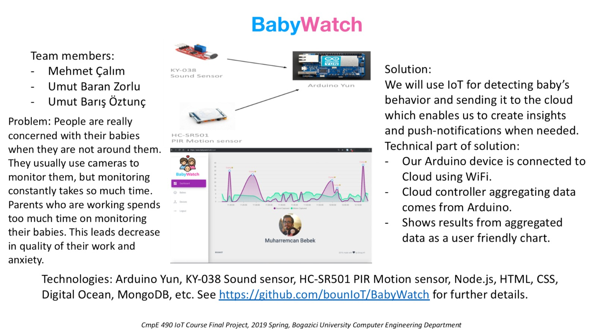
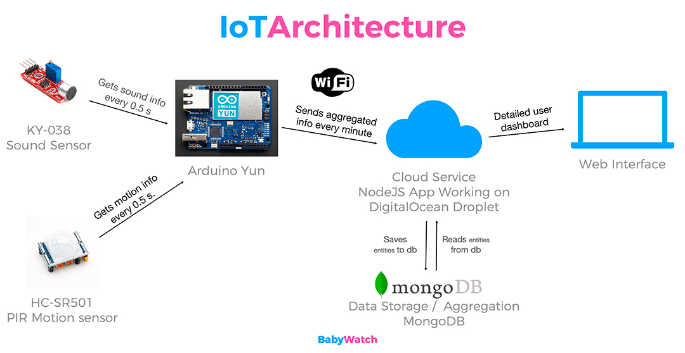
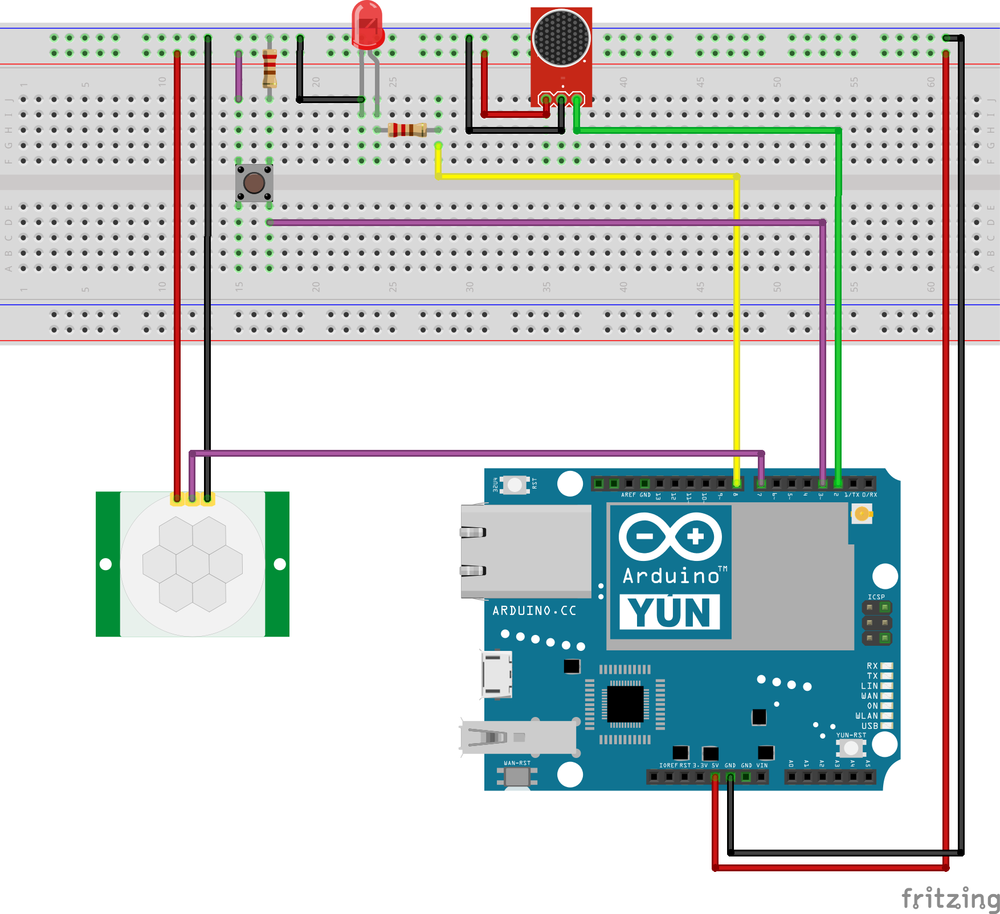

# BabyWatch

BabyWatch is a parental control device for working parents who are concerned with sleeping habits of their babies.

## Problem

People are really concerned with their babies when they are not around them. They usually use cameras to monitor them, but monitoring constantly takes so much time.

Parents who are working spends too much time on monitoring their babies. This leads decrease in quality of their work and anxiety.

## Solution

We are using IoT for detecting baby’s behavior and sending it to the cloud which enables us to create insights.

Our solution will make parents feel safer than normally they are and make baby monitoring less stressful and less time consuming thing by letting parents know that their baby is asleep even if they are not watching on camera.

## IoT Architecture

## Components

| Component             | Name                                        | Action                                                         |
|-----------------------|---------------------------------------------|----------------------------------------------------------------|
| Sound Sensor          | KY-038                                      | Integration                                                    |
| PIR Motion Sensor     | HC-SR501                                    | Integration                                                    |
| Wireless Connectivity | WIFI                                        | Integration(on Arduino Yùn)                                    |
| Embedded HW Platform  | Arduino Yùn                                 | Integration                                                    |
| Embedded HW App       | Arduino Ide                                 | Development                                                    |
| Cloud Platform        | Digital Ocean                               | Integration                                                    |
| Cloud App SW          | Node.JS                                     | Development(We implemented backend side of Cloud with Node.JS) |
| Web Client SW         | Material Dashboard with Javascript and HTML | Development(We used Material Dashboard and Bootstrap Library)s |

## Circuit Diagram

